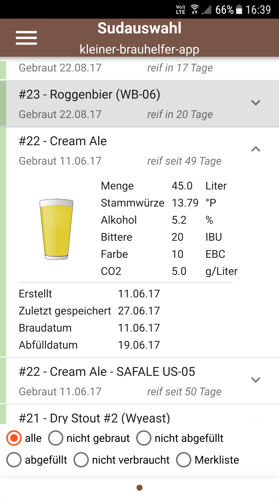
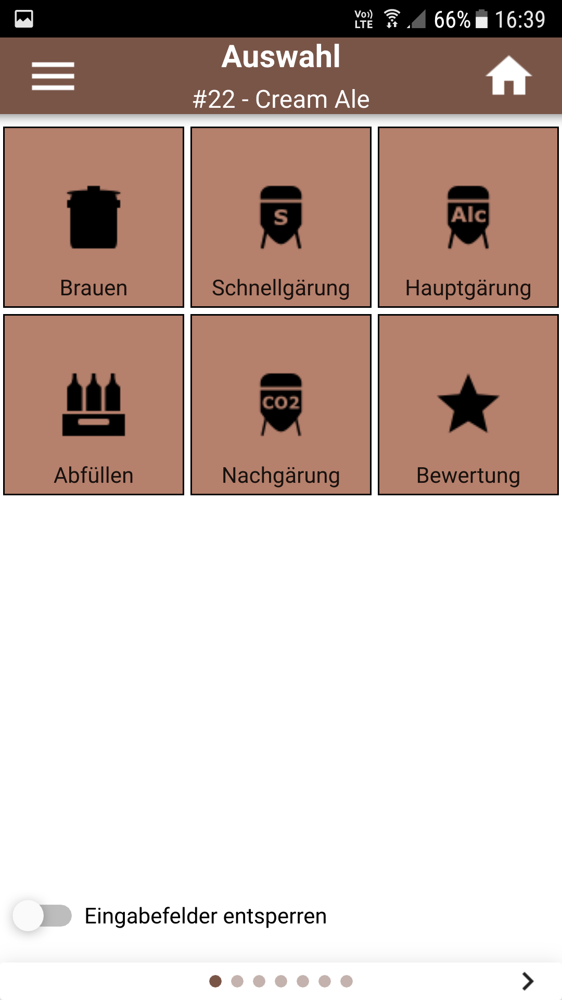
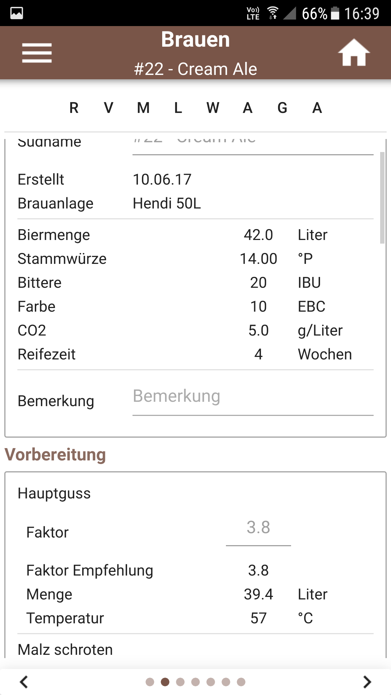
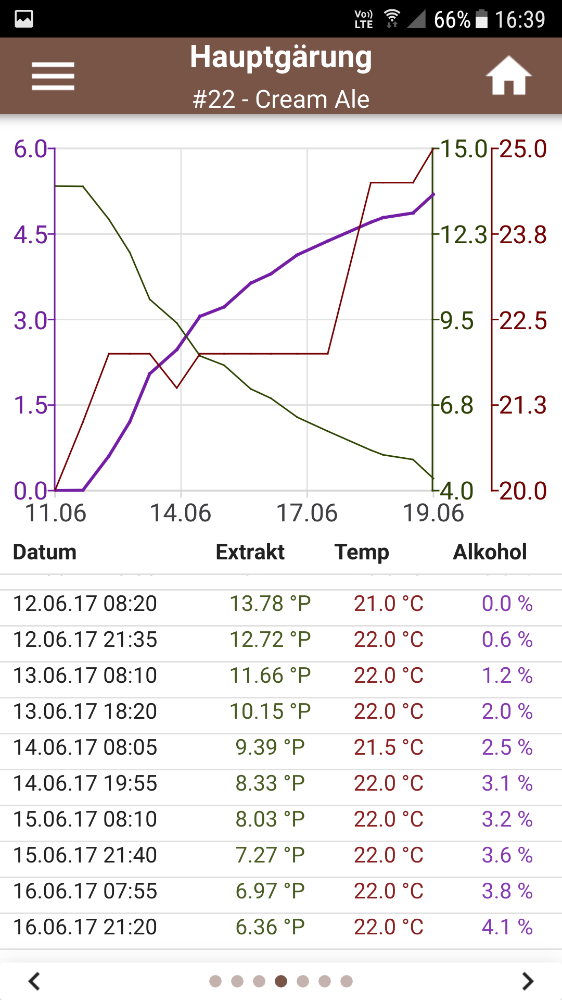
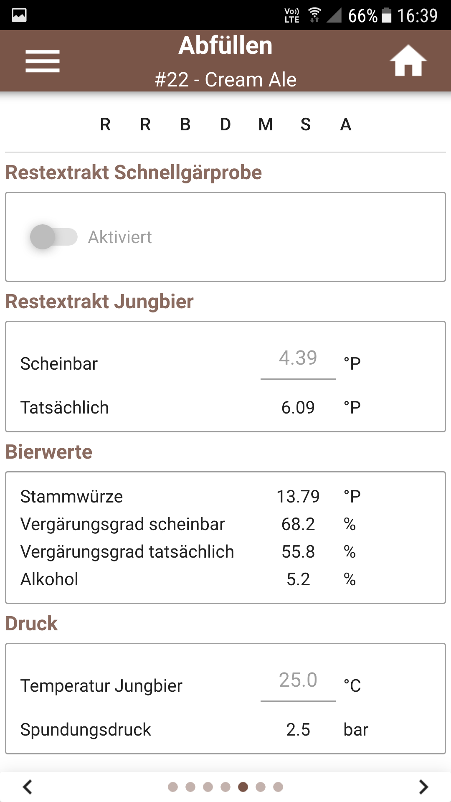
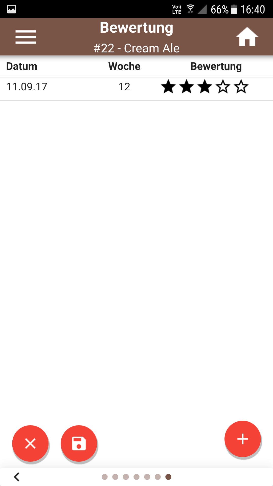
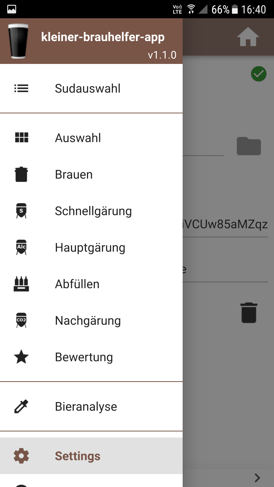

# kleiner-brauhelfer-app
Die kleiner-brauhelfer-app ist eine App, welche die Software [kleiner-brauhelfer-2](https://github.com/kleiner-brauhelfer/kleiner-brauhelfer-2) ergänzt. Die App wird nur für Android Geräte kompiliert. In Theorie sollte es aber auch mit anderen Betriebssysteme kompatibel sein.

**Diskussionsthread:**

https://hobbybrauer.de/forum/viewtopic.php?f=3&t=17466

## Download letzte Version
- [Version 2.2.0](https://github.com/kleiner-brauhelfer/kleiner-brauhelfer-app/releases/latest) passend zum [kleinen-brauhelfer-2](https://github.com/kleiner-brauhelfer/kleiner-brauhelfer-2)
- [Version 1.0.0](https://github.com/kleiner-brauhelfer/kleiner-brauhelfer-app/releases/tag/v1.0.0) passend zum [kleinen-brauhelfer bis 1.4.4.6](https://github.com/Gremmel/kleiner-brauhelfer)

## Änderungen & Erweiterungen

### Version 2.2.0 (18.07.2020)
- Neu: Kompatibel zum kleiner-brauhelfer-2 v2.2.0
- Neu: Verfügbar für armeabi-v7a, arm64-v8a, x86 und x86_64

### Version 2.1.1 (12.04.2020)
- Neu: Kompatibel zum kleiner-brauhelfer-2 v2.1.2

### Version 2.1.0 (25.01.2020)
- Neu: Kompatibel zum kleiner-brauhelfer-2 v2.1.0

### Version 2.0.0 (22.25.2019)
- Neu: Kompatibel zum kleiner-brauhelfer-2 v2.0.0

### Version 2.0.0beta2 (19.11.2019)
- Neu: Kompiliert mit Qt 5.13.2
- Neu: Prozentangabe bei Malzgaben
- Fix: WebDav

### Version 2.0.0beta1 (29.10.2019)
- Neu: Unterstüzung für kleiner-brauhelfer Version 2.x.x

## Screenshots

## Setup
### Synchronization mit Dropbox
1. *Dropbox developer area* aufrufen https://www.dropbox.com/developers.
2. Oben rechts auf *App Console* klicken.
3. Auf *Create your app* klicken.
4. *Scoped access* auswählen.
5. *App folder* auswählen.
6. App Name wählen.
7. Auf *Create app* klicken.
8. Auf der nächsten Seite ber *Access token expiration* auf *No expiration* umstellen.
9. Bei *Generated access token* untendran auf *Generate* klicken.
10. Oben auf den *Permissions* Reiter wechseln.
11. Folgende Optionen anwählen *files.metadata.write* und *files.content.write*.
12. Einstellungen mit *Submit* bestätigen.
10. Die Dropbox Seite aufrufen https://www.dropbox.com und dabei die *Dropbox developer area* offen lassen.
11. Bei den Datein sollte es jetzt einen Unterordner *App* und darin einen weiteren Unterordner mit dem App Name geben.
12. Datebankdatei dorthin platzieren.
13. *kleiner-brauhelfer-app* starten und zu den Einstellungen wechseln.
12. Access token aus der *Dropbox developer area* eingeben.
13. Pfad zur Datebank eingeben (z.B. /kb_daten.sqlite).
14. Die App sollte sich verbinden, sobald beide Felder korrekt ausgefüllt wurden.
15. Im Desktopprogramm *kleiner-brauhelfer* die Datenbank im entsprechenden Dropbox Ordner auswählen.
16. Fertig!?
