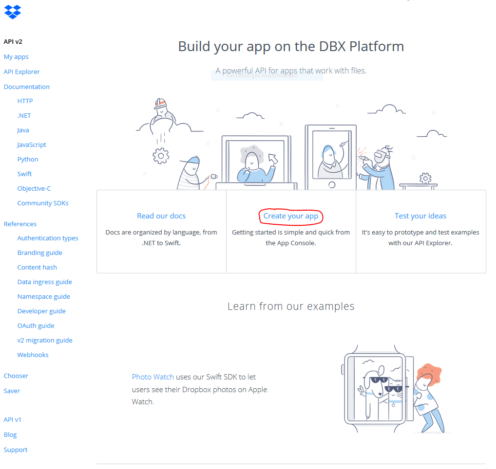
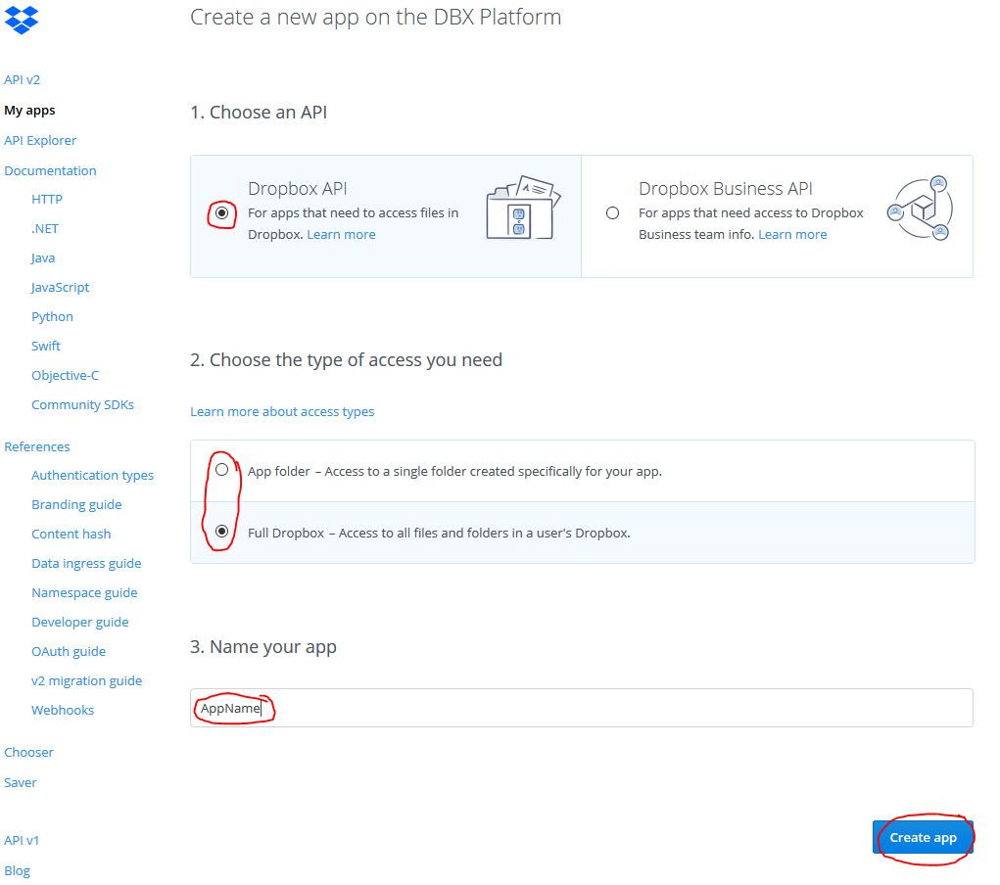
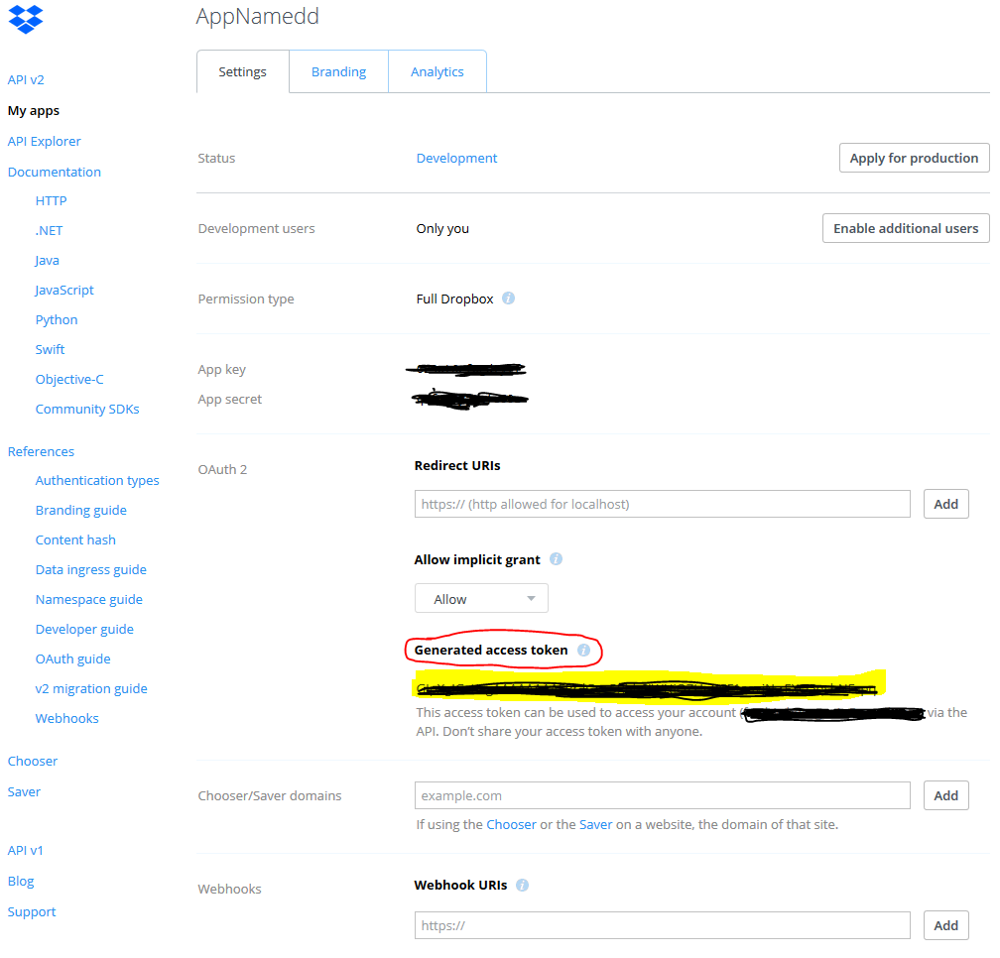
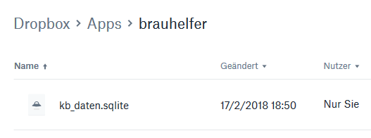
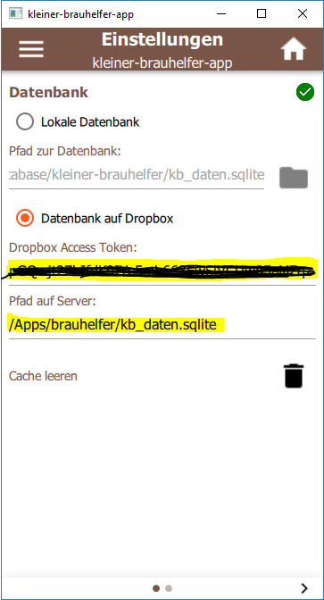

# kleiner-brauhelfer-app
Die kleiner-brauhelfer-app ist eine App, welche die Software [kleiner-brauhelfer](https://github.com/Gremmel/kleiner-brauhelfer) ergänzt.

**Diskussionsthread:**
https://hobbybrauer.de/forum/viewtopic.php?f=3&t=17466

## Download letzte Version
- [Version 2.0.0beta2](https://github.com/kleiner-brauhelfer/kleiner-brauhelfer-app/releases/tag/v2.0.0beta2) passend zum [kleinen-brauhelfer-2](https://github.com/kleiner-brauhelfer/kleiner-brauhelfer-2)
- [Version 1.0.0](https://github.com/kleiner-brauhelfer/kleiner-brauhelfer-app/releases/tag/v1.0.0) passend zum [kleinen-brauhelfer bis 1.4.4.6](https://github.com/Gremmel/kleiner-brauhelfer)

## Änderungen & Erweiterungen

### Version 2.0.0beta2
- Neu: Kompiliert mit Qt 5.13.2
- Neu: Prozentangabe bei Malzgaben
- Fix: WebDav

### Version 2.0.0beta1
- Neu: Unterstüzung für kleiner-brauhelfer Version 2.x.x

## Screenshots

## Setup
### Synchronization mit Dropbox
1. Dropbox developer area aufrufen https://www.dropbox.com/developers.

2. Einloggen mit Dropbox account.
3. Auf "Create your app" klicken.
4. "Dropbox API" auswählen.

5. Man kann entweder "App folder" oder "Full Dropbox" auswählen, aber "Full Dropbox" benötigt weniger Einstellungen.
6. App Name definieren.
7. Auf "Create app" klicken.
8. Auf der nächsten Seite auf "Generate" klicken, unterhalb von "Generated access token".

9. Falls "App folder" ausgwälhlt wurde, muss die Datenbank dort platziert werden. Bei "Full Dropbox" kann die Datenbank irgendwo platziert werden.
10. Pfad der Datenbank ("kb_daten.sqlite") auf der Dropbox ausfinding machen.

11. kleiner-brauhelfer-app starten und zu den Einstellungen wechseln.

12. Access token eingeben.
13. Relativer Pfad zur Datebank eingeben (z.B. /Apps/kleiner-brauhelfer/kb_daten.sqlite).
14. Die App sollte sich verbinden, sobald beide Felder korrekt ausgefüllt wurden.
